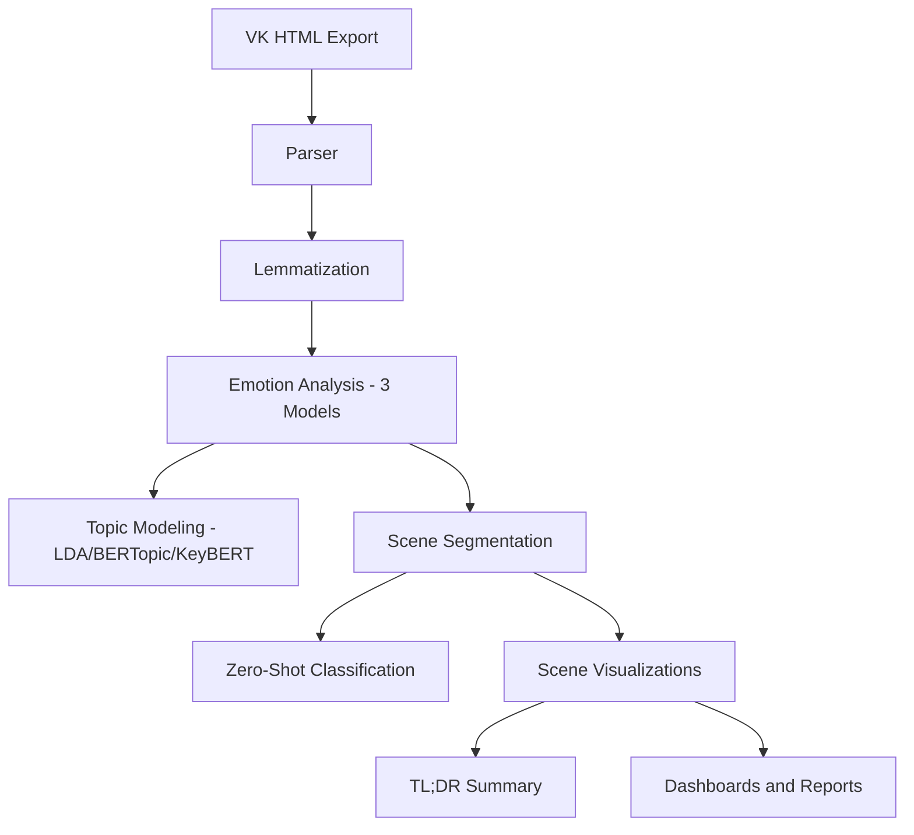

# Threadwalker

_Добро пожаловать в русскоязычную документацию проекта **Threadwalker v2** — интеллектуального пайплайна для анализа переписок и диалогов._

Threadwalker превращает экспортированные диалоги из мессенджеров (таких как **VK**, **Telegram**) в структурированные знания. Проект построен на принципах модульности, расширяемости и читабельности кода. Он ориентирован как на исследователей и разработчиков, так и на людей, стремящихся **понять** и **осмыслить** своё общение.

---

## 📌 Что такое Threadwalker?

**Threadwalker** — это исследовательский инструмент на Python, предназначенный для:

- 🧠 _эмоционального и семантического анализа_ текстовых диалогов;
- 🔍 _выявления скрытых тем, сцен и паттернов_;
- 📊 _визуализации развития отношений во времени_.

Он работает как пайплайн: от **парсинга HTML-диалога** до **финальных графиков и саммари**, проходя сквозь лемматизацию, тональность, тематическое моделирование, кластеризацию, zero-shot классификацию и дашборды.

Проект включает:
- более **30 скриптов**,
- 3 варианта анализа (общий, по автору A и по автору B),
- гибкую архитектуру с возможностью частичного запуска.

Threadwalker задуман как **психоаналитическая линза**, но с научно-технической реализацией.

---

## 🛠 Основные возможности

- 📦 Парсинг HTML-диалогов и разметка ролей
- 🧠 Лемматизация и очистка текста (в т.ч. продвинутая)
- 💌 Анализ ласковых слов во времени
- 📊 Анализ тональности и негативных всплесков
- 🔍 Тематическое моделирование (KeyBERT, LDA, BERTopic)
- 🎬 Сегментация на сцены и эмоции (в том числе deep)
- 🧬 Zero-shot классификация сцен (RoBERTa NLI)
- 🧾 Генерация саммари
- 📈 Финальные визуализации и дашборды (Plotly, pandas, matplotlib)

Пайплайн работает с несколькими предобученными моделями (`blanchefort`, `cointegrated`, `sunny3`) и позволяет анализировать как полную картину, так и отдельно по каждому участнику диалога.

---
## 🧱 Архитектура пайплайна



---

## ⚙️ Запуск пайплайна

Threadwalker реализован как управляемый скриптами пайплайн, основной точкой входа в который служит файл [`main.py`](../../main.py).

Запуск возможен в нескольких режимах: **полный анализ**, **тестовая обкатка**, **просмотр структуры**, **очистка** и др.

### 🔧 Базовые команды CLI

```bash
python main.py                # Запуск полного пайплайна
python main.py --test         # Тестовый запуск (быстро, на подмножестве данных)
python main.py --dry-run      # Показать порядок запуска скриптов без выполнения
python main.py --list-md      # Сохранить список скриптов в формате Markdown
python main.py --list-tsv     # Сохранить список скриптов в формате TSV
python main.py --clean        # Очистить временные файлы и результаты
````

> 💡 Все этапы пайплайна описаны в `scripts/`, и выполняются поочерёдно в строгом порядке. Структура задаётся вручную в `main.py` и легко расширяема.

### 🧪 Режимы запуска

| Режим             | Описание                                                         |
| ----------------- | ---------------------------------------------------------------- |
| `--test`          | Быстрый запуск с минимальным числом сообщений                    |
| `--semantic-only` | Запускает только семантический блок (без парсинга, лемм, эмоций) |
| `--dry-run`       | Только покажет, какие скрипты будут запущены                     |
| `--clean`         | Полная очистка временных и выходных данных                       |

Для продвинутых пользователей предусмотрена возможность изменять порядок, фильтровать скрипты, подключать кастомные конфиги.

---

## 📂 Навигация по документации

Документация проекта разбита на разделы по функциональному смыслу. Начните с **обзора**, затем изучите **архитектуру**, и переходите к интересующему вас **модулю анализа**.

### 🔑 Основные разделы:

- 📖 [Обзор проекта](overview.md)  
  Общая картина: цели, сферы применения, история создания.

- 🧩 [Архитектура пайплайна](architecture.md)  
  Визуальная и логическая схема всех этапов обработки.

- 🧠 [Модули анализа](modules/index.md)  
  Пошаговое описание каждого блока пайплайна (парсинг, эмоции, темы и др.).

- ⚙️ [Полный пайплайн](modules/full_pipeline.md)  
  Главный `main.py` и описание CLI-режимов.

> 📘 В других языковых версиях структура документации будет аналогичной.

## 🌐 Языки и локализация

Threadwalker — это интернациональный проект. Мы стремимся сделать его доступным для людей по всему миру.

📚 Документация доступна на следующих языках:

- 🇷🇺 **Русский** *(вы здесь)*
- 🇬🇧 [English](../en/index.md) *(в разработке)*
- 🇯🇵 [日本語](../ja/index.md) *(в разработке)*
- 🇨🇳 [中文](../zh/index.md) *(в разработке)*

> 💡 Переводы поддерживаются вручную. Вы можете помочь — предложите Pull Request или откройте Issue.

---

## 🧭 Куда идти дальше?

Если вы только начинаете знакомство с Threadwalker — следуйте этому маршруту:

1. 📖 Начните с [Обзора проекта](overview.md), чтобы понять цели и дух анализа.
2. 🧱 Посмотрите [Архитектуру пайплайна](architecture.md), чтобы увидеть, как всё устроено.
3. 🧠 Перейдите в [Модули анализа](modules/index.md) — каждый блок там описан отдельно.
4. ⚙️ Ознакомьтесь с [main.py и CLI](modules/full_pipeline.md), чтобы научиться запускать пайплайн.
5. 🧪 Попробуйте протестировать пайплайн в режиме `--test`, убедитесь, что всё работает.

> 🧭 Threadwalker — это исследование, а не просто утилита. Не спешите. Смотрите вглубь.

---

## 🧑‍💻 О проекте и авторе

Threadwalker родился как попытка понять и визуализировать то, что часто ускользает — **смыслы, эмоции, фрагменты отношений**, оставшиеся в переписке.

Он задуман как **исследовательский, психоаналитический и технический инструмент одновременно**. Это не просто набор скриптов, а способ взглянуть на цифровое прошлое иначе.

**Автор**: Arsenij Ingannamorte 
**GitHub**: [@IngannamorteScienceDev](https://github.com/IngannamorteScienceDev)

Если у вас есть предложения, идеи, баги — вы можете открыть Issue или создать Pull Request в основном [репозитории проекта](https://github.com/IngannamorteScienceDev/Threadwalker).

---

## 📄 Лицензия

Весь проект Threadwalker (код, структура, документация, пояснения) распространяется под лицензией **Creative Commons BY-NC-ND 4.0 International**.

> Вы можете свободно запускать и изучать проект, **при соблюдении следующих условий**:

- 🏷 **BY** — необходимо указание автора (Arsenij Ingannamorte / @IngannamorteScienceDev)
- 🚫 **NC** — запрещено использование в коммерческих целях
- 🔒 **ND** — запрещено распространять модифицированные версии

🔗 Полный текст лицензии: [creativecommons.org/licenses/by-nc-nd/4.0](https://creativecommons.org/licenses/by-nc-nd/4.0)

Если вы хотите использовать Threadwalker в коммерческих, образовательных или встроенных продуктах — свяжитесь с автором для отдельного разрешения.

---
